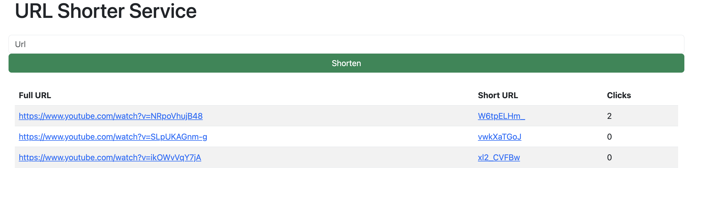

<!-- Heading -->

# URL Shorten Docker

The URL Shorten Docker is a web application built with Node.js that allows you to shorten long URLs into shorter, more manageable links.

It utilises MongoDB as the database to store the shortened URLs and Docker for containerisation.:blush::blush::blush:

:information_source: This application uses the latest version of Docker Compose (Compose V2, official upgrade from the end of June 2023) for optimal compatibility and support.

## 

## Table of Contents- [URL Shorten Docker](#url-shorten-docker)

- [URL Shorten Docker](#url-shorten-docker)
  - [](#)
  - [Table of Contents- URL Shorten Docker](#table-of-contents--url-shorten-docker)
  - [Features](#features)
  - [Prerequisites](#prerequisites)
  - [Getting Started](#getting-started)
  - [Folder Structure](#folder-structure)

---

## Features

- Shorten long URLs into shorter, customised links
- Redirect users to the original URL when they visit the shortened link
- Track the number of clicks on each shortened link
- Store the shortened links and their corresponding original URLs in a MongoDB database
- Containerise the application using Docker for easy deployment and scalability

## Prerequisites

To run the URL Shorten Docker using Docker, make sure you have Docker installed on your machine. You can download Docker from [https://www.docker.com](https://www.docker.com).

## Getting Started

Follow these steps to get the URL Shorten Service up and running using Docker:

1. Clone the repository:

   ```shell
   git clone https://github.com/your-username/url-shortener-docker.git

   ```

2. Navigate to the project directory:

   ```shell
   cd url-shortener-docker

   ```

3. Build and start the Docker containers using docker compose:

   ```shell
   docker compose up -d --build

   ```

   This command will build the Docker image and start the necessary containers for the server and the MongoDB database in detached mode.

4. Once the containers are up and running, you can access the URL shortener server at [http://localhost:3000](http://localhost:3000)

---

## Folder Structure

```css
├── Readme.md
├── docker-compose.yml
└── url-shortener
    ├── Dockerfile
    ├── models
    │   └── shortUrl.js
    ├── package-lock.json
    ├── package.json
    ├── src
    │   └── server.js
    └── views
        └── index.ejs
```

- docker-compose.yml: This file defines the services and configurations for Docker containers.
- url-shortener/Dockerfile: The Dockerfile used to build the server container.
- url-shortener/models/shortUrl.js: The MongoDB data model for the short URL.
- url-shortener/package-lock.json and url-shortener/package.json: These files define the project dependencies and configuration.
- url-shortener/src/server.js: The main server file containing the implementation logic.
- url-shortener/views/index.ejs: The EJS template for the server's homepage.
